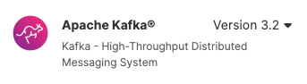
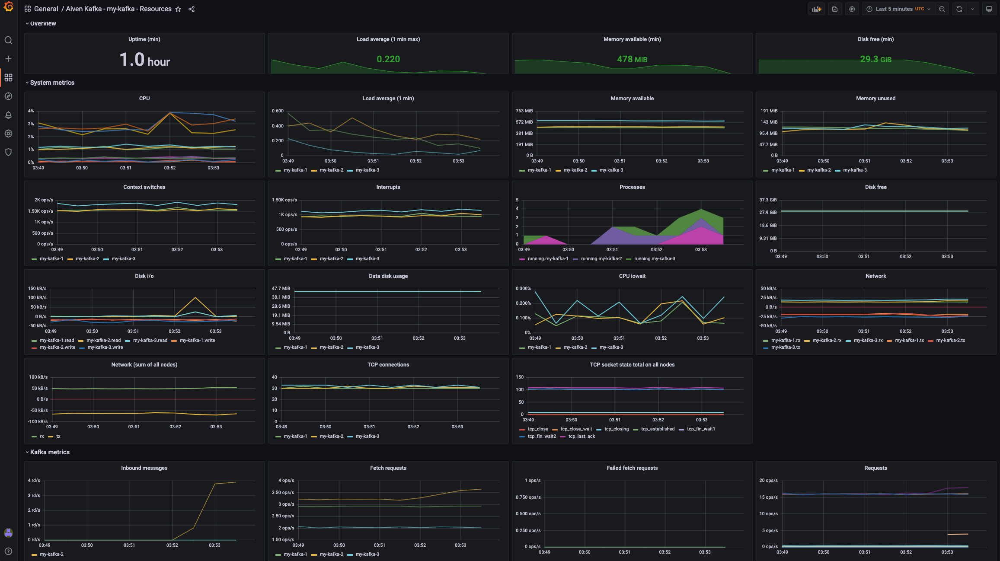

# Stock Data Producer for Apache Kafka®

## Description

**Stock Data Producer for Apache Kafka®** is a complete demo app allowing you to quickly produce live stock streaming dataset and push it to an Apache Kafka® topic. It gives an example on how easy is to create great streaming data to feed Apache Kafka. 

* **Apache Kafka**: a [distributed streaming platform](https://kafka.apache.org/)
* **Topic**: all Apache Kafka records are organised into topics, you can think of a topic like an event log or a table if you're familiar with databases.
* **Apache Kafka Producer**: an entity/application that publishes data to Apache Kafka

We will start with [starting Apache Kafka Service](#startkafka) in Aiven. We will then [produce messages ](#produce) and send them to Apache Kafka. We will [read the sent messages ](#read) in Apache Kafka. Eventually gathering the metrics in InfluxDB and viewing them on Grafana [Grafana](#integrate). 

# <a name="startkafka"> Starting your Apache Kafka Service with Aiven.io
There are 2 options to run Apache Kafka Service with Aiven. Either through [Aiven.io Console](https://console.aiven.io/signup?utm_source=github&utm_medium=organic&utm_campaign=blog_art&utm_content=post) or  [Aiven.io's CLI](https://github.com/aiven/aiven-client). 
You can choose either one and move to viewing of messages <a name="head1234">


## 1. Creating Apache Kafka Service through Aiven Console
If you don't have a Apache Kafka Cluster available, you can easily start one in [Aiven.io Console](https://console.aiven.io/signup?utm_source=github&utm_medium=organic&utm_campaign=blog_art&utm_content=post).

1. Login to your Aiven console https://console.aiven.io/
2. Create a new service by clicking the  button on the top right of the screen.
    1. In the Select Your Service section, select Apache Kafka.

        
    2. In the "Select Service Cloud Provider", select AWS
    
        
    3. In the "Select Service Cloud Region", choose "aws-eu-central-1"
    
        
    
    4. In the "Select Service Plan, click Startup tab and then select Startup-2

        
        
    5. In the "Provide Service Name" , give the service name `my-kafka`
    
    6. Then click on the Create Service Button. 
        
    
    7. Now wait for around 2 minutes until Kafka service is in running  state.
    8. Go to the "Topics" Tab and add a new topic `stocks` and click Add Topic button

## 2. Creating Apache Kafka Service through CLI 
Once created your account you can start your Apache Kafka service with [Aiven.io's CLI](https://github.com/aiven/aiven-client)

Set your variables first:
```bash
KAFKA_INSTANCE_NAME=my-kafka
PROJECT_NAME=my-project
CLOUD_REGION=aws-eu-central-1
AIVEN_PLAN_NAME=startup-2
DESTINATION_FOLDER_NAME=~/kafkacerts
```
Parameters:
* `KAFKA_INSTANCE_NAME`: the name you want to give to the Apache Kafka instance
* `PROJECT_NAME`: the name of the project created during sing-up
* `CLOUD_REGION`: the name of the Cloud region where the instance will be created. The list of cloud regions can be found
 with
```bash
avn cloud list
```
* `AIVEN_PLAN_NAME`: name of Aiven's plan to use, which will drive the resources available, the list of plans can be found with
```bash
avn service plans --project <PROJECT_NAME> -t kafka --cloud <CLOUD_PROVIDER>
```
* `DESTINATION_FOLDER_NAME`: local folder where Apache Kafka certificates will be stored (used to login)

You can create the Apache Kafka service with

```bash
avn service create  \
  -t kafka $KAFKA_INSTANCE_NAME \
  --project $PROJECT_NAME \
  --cloud  $CLOUD_PROVIDER \
  -p $AIVEN_PLAN_NAME \
  -c kafka_rest=true \
  -c kafka.auto_create_topics_enable=true \
  -c schema_registry=true
```

---

You can download the required SSL certificates in the `<DESTINATION_FOLDER_NAME>` with

```bash
avn service user-creds-download $KAFKA_SERVICE_NAME \
  --project $PROJECT_NAME    \
  -d $DESTINATION_FOLDER_NAME \
  --username avnadmin
```

And retrieve the Apache Kafka Service URI with

```bash
avn service get $KAFKA_SERVICE_NAME \
  --project $PROJECT_NAME \
  --format '{service_uri}'
```

The Apache Kafka Service URI is in the form `hostname:port` and provides the `hostname` and `port` needed to execute the code.
You can wait for the newly created Apache Kafka instance to be ready with

```bash
avn service wait $KAFKA_SERVICE_NAME --project $PROJECT_NAME
```


## Installation
This demo app is relying on [Faker](https://faker.readthedocs.io/en/master/) and [kafka-python](https://kafka-python.readthedocs.io/en/master/usage.html) which the former requiring Python 3.5 and above.
The installation can be done via

```bash
pip install -r requirements.txt
```

## <a name="produce"></a> Producing messages and sending to Apache Kafka

The Python code can be run in bash with the following,
in SSL security protocol:
```bash
python main.py \
  --security-protocol ssl \
  --cert-folder ~/kafkaCerts/ \
  --host kafka-<name>.aivencloud.com \
  --port 26411 \
  --topic-name stocks \
  --nr-messages 0 \
  --max-waiting-time 0
```
in PLAINTEXT security protocol:
```bash
python main.py \
  --security-protocol plaintext \
  --host your-kafka-broker-host \
  --port 26411 \
  --topic-name stocks \
  --nr-messages 0 \
  --max-waiting-time 0
```
Where
* `security-protocol`: Security protocol for Kafka. PLAINTEXT or SSL are supported.
* `cert-folder`: points to the folder containing the Apache Kafka CA certificate, Access certificate and Access key (see [blog post](https://aiven.io/blog/create-your-own-data-stream-for-kafka-with-python-and-faker?utm_source=github&utm_medium=organic&utm_campaign=blog_art&utm_content=post) for more)
* `host`: the Apache Kafka host
* `port`: the Apache Kafka port
* `topic-name`: the Apache Kafka topic name to write to (the topic needs to be pre-created or `kafka.auto_create_topics_enable` parameter enabled)
* `nr-messages`: the number of messages to send
* `max-waiting-time`: the maximum waiting time in seconds between messages

If successfully connected to a Apache Kafka cluster, the command will output a number of messages (`nr-messages` parameter) that are been sent to Apache Kafka in the form

```json
{
  'stock_name': 'BTC-USD', 
  'stock_value': 23194.01171875, 
  'timestamp': '2022-08-08T03:53:29.952372'
}
```

With
* `stock_name`: is the stock name being traded in the market, you can check and change the full list of stock pairs in [stockproducer.py](stockproducer.py)
* `stock_value`: is the live price value of the stock pair being traded. This data is coming from Yahoo's finance API
* `timestamp`: timestamp represents a string with the date in ISO 8601 format

# <a name="read"></a> Reading the messages in Apache Kafka 
Once the messages have been produced by the producer, these messages can be viewed in the Aieven Console. 
1. Go to the "overview" tab and enable the `Apache Kafka REST API (Karapace)`
2. Click on the "Topics" tab and the click on the topic `stocks`
3. Click on `Messages` button and then `Fetch Messages`
4. Enable the `Decode from base64`. All messages sent through producer can be viewed here. 


# <a name="integrate"></a> Integrations - Observability and Monitoring

In this section, observability and monitoring will be added to the Apache Kafka cluster. First all metrics will be sent to Influx DB. Then Grafana will be used to to view the metrics. Here are the steps to enable these integrations.

1. In the Apache Kafka project in the Aiven Console, select the "Overview" tab. 
2. Go to the "Service Integrations" section and click on Setup Integration. 

   
3. Select Metrics Integration and click on "Use Integration"

    
4. Click on "New Service" and select "New InfluxDB service"

    
5. At the bottom right of the page, click on on "Create and enable" button
    
    
    
6. Active InfluxDB Integration can be seen at the top
    
    
    
7. Click on the above link with the name of the InfluxDB to go into the Influx DB Service. 
8. In the overview section in the Influx DB instance, go to the Service Integrations sections and click on Manage integrations
    
    

9. Click on "Use integration" button in the Grafana Metrics Dashboard 

    
10. Click on "New Service" and press "Continue"  
  
    
    
11. At the bottom right, click on "Create and enable" button 
    

12. At the top, both InfluxDB and Grafana services are activated and integrated
    

13. Click on the above Grafana link with the name of the Grafana Dashboard to go in to the Service.
14. In the overview tab, go to the Connection Information. Open the `Service URI` in the browser.  

    

15. Use the `User` and `Password` from the Connection Information section to login

    
16. On the left menu, hover over the Dashboard and click on the "Browser" button. 

    
17. In the General section, click on the my-kafka link.   

    
18. All the metrics from Apache Kafka are visible here on this dashboard. 

    
    